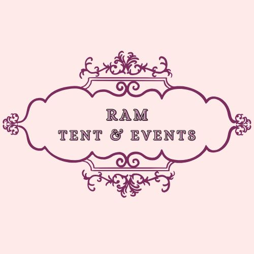

# 🎪 Ram Tent & Events

A stunning event planning website built using **React + Vite**, designed for the renowned Jaipur-based company **Ram Tent and Events**. This responsive site showcases their services, gallery, and contact details while offering a delightful user experience in both light and dark modes.



---

## 🌟 Live Website

🔗 **[Visit Now](https://kunalshrimal.github.io/ram-tent-and-events/)**

---

## 🛠️ Features

- ✅ Responsive layout (mobile-first)
- 🌙 Dark/Light mode toggle
- 🖼️ Gallery with image preview
- 🎥 Video section with interactive display
- 🎉 Service sections (with collapsible cards)
- 🧾 About & Contact sections
- 📱 WhatsApp & Instagram social integration
- ⚡ Built with **Vite** for blazing-fast performance

---

## 🖼️ Pages Included

- `Home`
- `About`
- `Gallery`
- `Services`
- `Contact`

---

## 🔧 Technologies Used

| Tech             | Purpose                     |
|------------------|-----------------------------|
| React.js         | Frontend framework          |
| Vite             | Fast dev/build tool         |
| Tailwind CSS     | Utility-first styling       |
| React Icons      | Icon integration            |
| GitHub Pages     | Hosting                     |

---

## 🚀 Installation

```bash
git clone https://github.com/kunalshrimal/ram-tent-and-events.git
cd ram-tent-and-events
npm install
npm run dev
